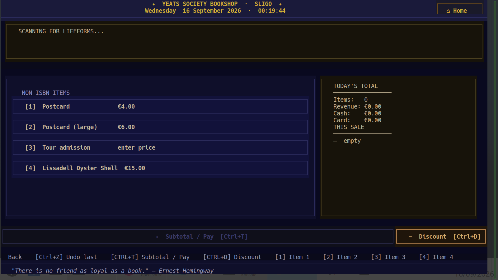
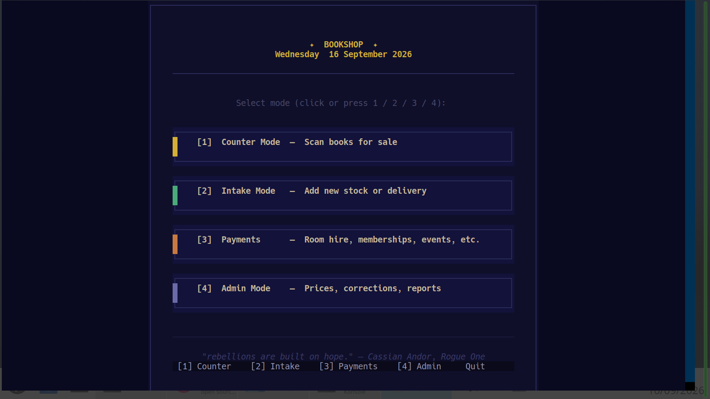

# Colophon

A terminal point-of-sale system for small independent and nonprofit shops — built for a bookshop, but usable for any small counter that sells a mix of barcoded and non-barcoded items.

Barcode scanner → SQLite catalog → daily CSV reports → office network share (or a local folder if there's no network share at all).

No subscription, no cloud account, no card-terminal integration required — it runs entirely on one Linux machine.

**Origin:** Colophon was originally built for and is used daily at the Yeats Society Bookshop, Sligo, Ireland — a small volunteer-run heritage-site shop that had no dedicated IT budget and was previously tracking sales and stock by hand. It replaced pen-and-paper book-entry with barcode scanning and automatic daily reports to the office.



See **[USER_GUIDE.md](USER_GUIDE.md)** for full staff and setup documentation. If you're an AI agent installing, verifying, or changing this project, read **[AGENTS.md](AGENTS.md)** first.

---

## Why this exists

Commercial POS systems (Square, Vend, Lightspeed, etc.) charge ongoing subscriptions that don't make sense for a shop run by volunteers with a handful of transactions a day. General-purpose open-source POS systems (Odoo POS, Unicenta, WallacePOS) are built for full retail/hospitality operations and expect a web server and a database to administer. Colophon is neither — it's a single Python process with a terminal UI, running on whatever laptop is already in the shop, with ISBN barcode lookup built in for anyone selling secondhand or new books alongside other small items (postcards, tickets, prints).

---

## Requirements

- Python 3.11+ (developed on Python 3.14 / Kubuntu 26)
- Linux
- USB barcode scanner in HID keyboard mode (NetumScan NSL8 or similar)

---

## Setup (new machine)

```bash
# Install venv support if needed (Kubuntu/Ubuntu) — adjust the version to match your Python
sudo apt install python3.14-venv

# From inside the Colophon folder:
python3 -m venv .venv
source .venv/bin/activate
pip install -r requirements.txt
chmod +x scripts/*.sh

# Copy the example config and edit it for your shop
cp config/settings.example.yaml config/settings.yaml
```

The database (`db/bookshop.db`) is created automatically on first run.

---

## Running the system

```bash
./scripts/launch.sh
```

This opens the launcher screen with four modes:



| Mode | Who uses it |
|---|---|
| **Counter** | All staff — scan items, take payment |
| **Intake** | Stock volunteers — receive deliveries |
| **Payments** | Anyone — sundry payments (room hire, memberships, etc.) |
| **Admin** | Managers — prices, stock, catalog, reports |

Admin PIN is set in `config/settings.yaml`. Every mode shows its available keys at the bottom of the screen — **Ctrl+Q quits the whole program from anywhere**, not just the current mode.

---

## Generating reports manually

```bash
# Today's report
.venv/bin/python -m app.summary

# Specific date
.venv/bin/python -m app.summary --date 2025-06-01
```

Generates four CSV files — sales, sundry payments, summary (with cash/card breakdown), and full catalog inventory — into a `YYYY/MM/` folder under the office share if mounted, otherwise under `sync/` locally.

---

## In-house barcodes

Items without commercial barcodes (postcards, tour tickets, prints) can be registered and given printable EAN-13 barcodes:

```bash
# Register an item and generate its barcode image
python scripts/gen_barcode.py --add "Postcard — example" --price 4.00

# Generate a printable A4 sheet of all in-house barcodes
python scripts/gen_barcode.py --sheet
# → barcodes/print_sheet.html — open in browser, Ctrl+P to print

# List all registered in-house items
python scripts/gen_barcode.py --list
```

---

## Automating the daily report and backup (cron)

```bash
crontab -e
# Add (adjust path to match your installation):
0 23 * * * cd /path/to/colophon && .venv/bin/python -m app.summary >> logs/summary_cron.log 2>&1
5 23 * * * cd /path/to/colophon && .venv/bin/python -m app.backup  >> logs/backup_cron.log 2>&1
```

The `>> logs/*.log 2>&1` matters — cron discards output by default, so without it a failure fails silently every night.

`python -m app.backup` writes a nightly copy of the database (using SQLite's online backup API, so it's safe even while the app is running) to `backups/` on the office share, or `sync/backups/` locally if the share isn't available. It keeps the most recent 14 daily backups and prunes older ones automatically.

---

## Configuration

Copy `config/settings.example.yaml` to `config/settings.yaml` and edit it for your shop. Key settings:

```yaml
shop:
  name: "My Shop"

admin:
  pin: "0000"

stock:
  low_stock_threshold: 2

office_sync:
  mount_path: "/mnt/office"
  report_subdir: "bookshop_reports"

non_isbn_items:
  - name: "Postcard"
    price: 4.00
  - name: "Tour admission"
    price:              # Leave blank = ask at counter
```

---

## Office share mount

Add to `/etc/fstab` for automatic mounting. Put the credentials in a separate root-owned file rather than inline (fstab is world-readable):

```
# /etc/colophon/smb-credentials — sudo chmod 600, sudo chown root:root
username=your-username
password=your-password
```

```
# Samba / Windows share / NAS
//server-name/share  /mnt/office  cifs  credentials=/etc/colophon/smb-credentials,uid=1000,gid=1000,_netdev,nofail,x-systemd.automount  0  0

# NFS
server-name:/share   /mnt/office  nfs   defaults,_netdev,nofail  0  0
```

`nofail` matters — without it, a down NAS can hang the machine at boot, defeating the `sync/` fallback below. Then run `sudo mount -a`. If the mount is unavailable, reports fall back to `sync/`.

---

## Tests

```bash
source .venv/bin/activate
pytest tests/ -v
```

---

## Project structure

```
colophon/
├── app/
│   ├── catalog.py     # Barcode lookup, stock management, DB schema
│   ├── barcode.py     # In-house barcode SVG/label generation
│   ├── logger.py      # sale recording, void/undo
│   ├── summary.py     # daily CSV reports, office sync
│   ├── utils.py       # shared helpers (config, paths, CSV)
│   └── ui/
│       ├── counter.py  # Counter mode TUI
│       ├── intake.py   # Intake mode TUI (catalog, stock, deliveries)
│       ├── payments.py # Payments mode TUI (sundry payments)
│       ├── admin.py    # Admin mode TUI
│       ├── launcher.py
│       ├── widgets.py  # Shared Textual widgets
│       └── quotes.py   # Rotating footer quotes
├── barcodes/          # Generated in-house barcode SVGs + print sheet
├── config/
│   ├── settings.example.yaml   # Template — copy to settings.yaml and edit
│   └── settings.yaml           # Your shop's actual config (gitignored)
├── db/
│   └── bookshop.db    # SQLite (auto-created, copy to migrate)
├── sync/              # Local fallback when office mount unavailable
├── scripts/
│   ├── launch.sh
│   └── gen_barcode.py # In-house barcode generator (CLI)
├── tests/
│   └── test_catalog.py
├── logs/
└── USER_GUIDE.md      # Full staff and admin documentation
```

---

## License

AGPL-3.0. See [LICENSE](LICENSE). In short: use it, modify it, install and charge for it as a service — but if you distribute a modified copy (including running a hosted version of it for others), you must make your source available under the same license.
